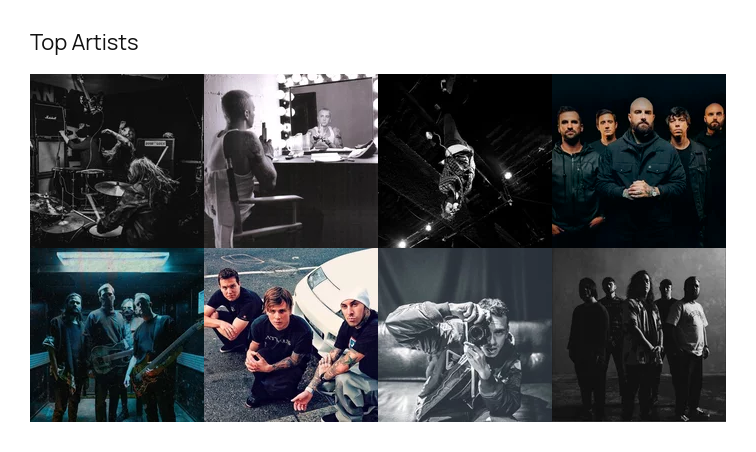
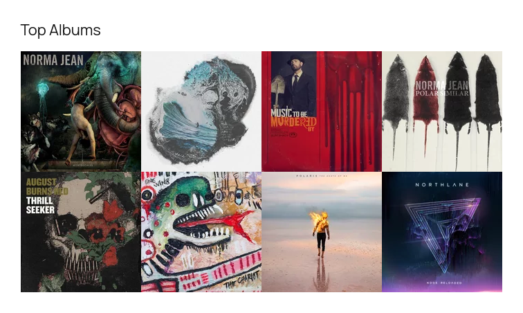
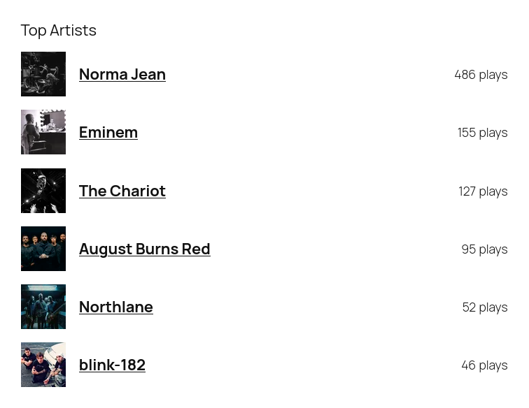
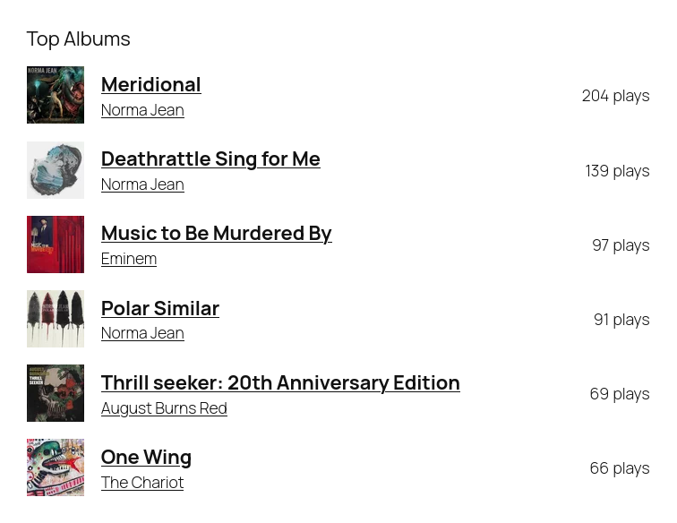
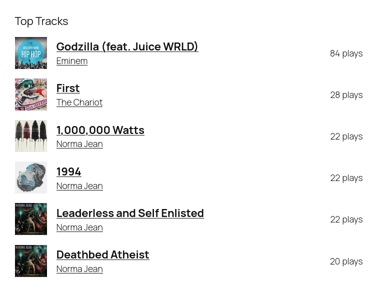

# Profile Blocks for LastFM

## Requirements

- PHP 7.4+
- [WordPress](http://wordpress.org/) 6.8+

## Installation

**Automatic installation**

To do an automatic install of LastFM Profile Blocks, log in to your WordPress dashboard, navigate to the Plugins menu, and click “Add New.”

In the search field type “LastFM Profile Blocks,” then click “Search Plugins.” Once you’ve found us, you can click “Install Now” and WordPress will take it from there.

**Manual installation**

Manual installation method requires [downloading the LastFM Profile Blocks plugin](https://wordpress.org/plugins/profile-blocks-lastfm) and uploading it to your web server via your favorite FTP application. The WordPress codex contains [instructions on how to do this here](https://wordpress.org/support/article/managing-plugins/#manual-plugin-installation).

## Development

Clone this repository:
```
git clone https://github.com/jrtashjian/profile-blocks-lastfm.git
```

Install [PHP-Scoper](https://github.com/humbug/php-scoper) globally and run it to prefix required dependencies:
```
composer global require humbug/php-scoper && composer run phpscoper
```

Install the necessary Node.js and Composer dependencies:
```
composer install && npm install
```

Run the development build which will watch for changes:
```
npm run start
```

## Screenshots


*Top Artists - Grid Layout*


*Top Albums - Grid Layout*


*Top Artists - List Layout*


*Top Albums - List Layout*


*Top Tracks - List Layout*
